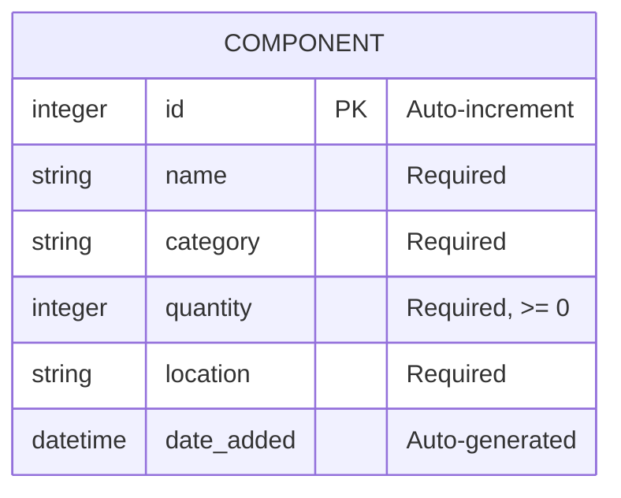

# API Documentation

## Base URL
`/api/components`

---

## 1. Create Component
- **Method**: `POST`
- **URL**: `/api/components`
- **Request Body** (JSON):
  ```json
  {
    "name": "10k Resistor",
    "category": "Resistor",
    "quantity": 100,
    "location": "Shelf A"
  }
  ```
- **Response Success** (`201 Created`):
  ```json
  {
    "id": 1,
    "name": "10k Resistor",
    "category": "Resistor",
    "quantity": 100,
    "location": "Shelf A",
    "date_added": "2026-09-15T21:18:00.000000"
  }
  ```
- **Error Status Codes**: `400 Bad Request` (missing fields, invalid quantity), `409 Conflict` (duplicate name + category).

---

## 2. List All Components
- **Method**: `GET`
- **URL**: `/api/components`
- **Query Parameters**: `?category=<string>` (Optional filter)
- **Response Success** (`200 OK`):
  ```json
  [
    {
      "id": 1,
      "name": "10k Resistor",
      ...
    }
  ]
  ```

---

## 3. Get One Component
- **Method**: `GET`
- **URL**: `/api/components/<id>`
- **Response Success** (`200 OK`):
  ```json
  {
    "id": 1,
    "name": "10k Resistor",
    ...
  }
  ```
- **Error Status Codes**: `404 Not Found`

---

## 4. Update Component
- **Method**: `PUT`
- **URL**: `/api/components/<id>`
- **Request Body** (JSON - all fields optional):
  ```json
  {
    "quantity": 150,
    "location": "Bin 2"
  }
  ```
- **Response Success** (`200 OK`): Returns the updated component object.
- **Error Status Codes**: `400 Bad Request`, `404 Not Found`, `409 Conflict`

---

## 5. Delete Component
- **Method**: `DELETE`
- **URL**: `/api/components/<id>`
- **Response Success** (`200 OK`):
  ```json
  {
    "message": "Deleted successfully"
  }
  ```
- **Error Status Codes**: `404 Not Found`

---

# Entity Relationship Diagram (ERD)

Here is a text-based/mermaid representation of the SQLite schema.


**Constraints**:
- `id` is the Primary Key.
- `UNIQUE(name, category)` ensures that no duplicate component with the same name exists under the same category.
